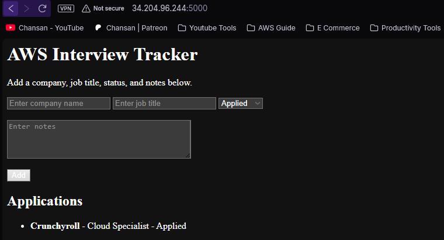

# AWS Interview Tracker

A simple Flask app to track job applications.

## Screenshot

## Features
- Add company name
- Add job title
- Select application status
- Add notes
- Save data locally with JSON

## Tech Used
- Python
- Flask
- Git
- GitHub

## How to Run
1. Install dependencies:
   py -m pip install -r requirements.txt

2. Start the app:
   py app.py

3. Open in browser:
   http://127.0.0.1:5000
